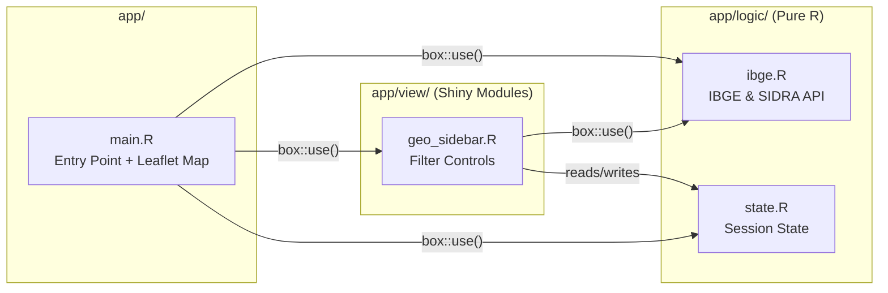
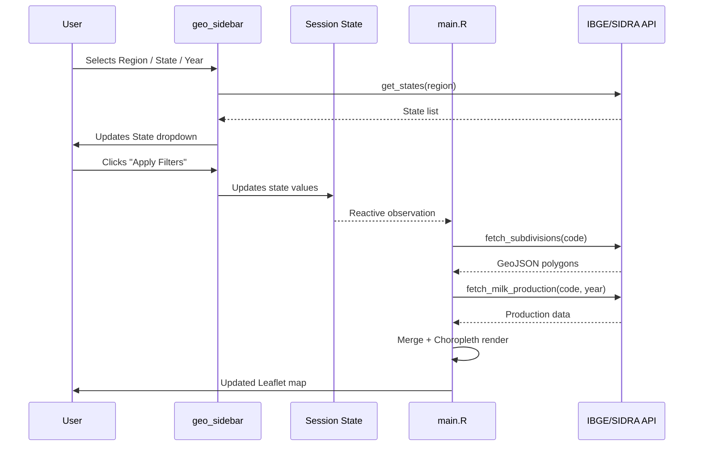

# Architecture — zarc-app

## Overview

**zarc-app** follows the [Rhino](https://appsilon.github.io/rhino/) architecture, which enforces a strict separation between **business logic** and **UI/view** code. This pattern improves testability, maintainability, and enables future module reuse across different interfaces.

---

## Module Separation



---

## Layers

### `app/logic/` — Business Logic

Files in this directory contain **pure R functions** with no Shiny reactivity. They can be:

- Tested independently (no Shiny session required for most tests)
- Reused in scripts, APIs, or other applications
- Mocked easily in integration tests

| File       | Responsibility                                                  |
|------------|-----------------------------------------------------------------|
| `ibge.R`   | HTTP calls to IBGE Localidades API (regions, states, mesoregions) and SIDRA API (Table 74 — milk production) |
| `state.R`  | Manages a `reactiveValues` session state object; JSON serialization for "shareable research" |

### `app/view/` — Shiny Modules

Files here define **Shiny modules** (UI + Server pairs) that handle user interaction and reactivity.

| File             | Responsibility                                |
|------------------|-----------------------------------------------|
| `geo_sidebar.R`  | Cascading filter dropdowns (Region → State → Mesoregion → Year) with "Apply" action button and session export |

### `app/main.R` — Entry Point

The top-level module that:

1. Defines the page layout (sidebar + map)
2. Initializes the session state (`state$create_state()`)
3. Wires up child modules
4. Renders the Leaflet choropleth map reactively based on state changes

---

## Import System

All imports use the `{box}` module system:

```r
# Import logic functions
box::use(app/logic/ibge[get_regions, get_states])

# Import a view module
box::use(app/view/geo_sidebar)
```

This ensures:
- **Explicit dependencies** — no hidden `library()` calls
- **Namespacing** — avoids function name collisions
- **Traceability** — each import is auditable

---

## State Management

The session state (`app/logic/state.R`) acts as a **single source of truth**:

```
User Interaction → geo_sidebar (updates state) → main.R (observes state → renders map)
```

The state is serializable to JSON, enabling:
- **Reproducible research** — share exact filter configurations
- **Session persistence** — restore previous analysis sessions
- **Audit trail** — log researcher exploration paths

---

## Data Flow


