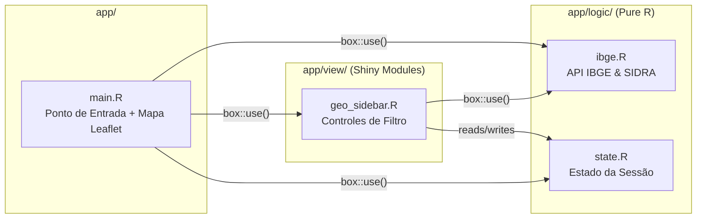
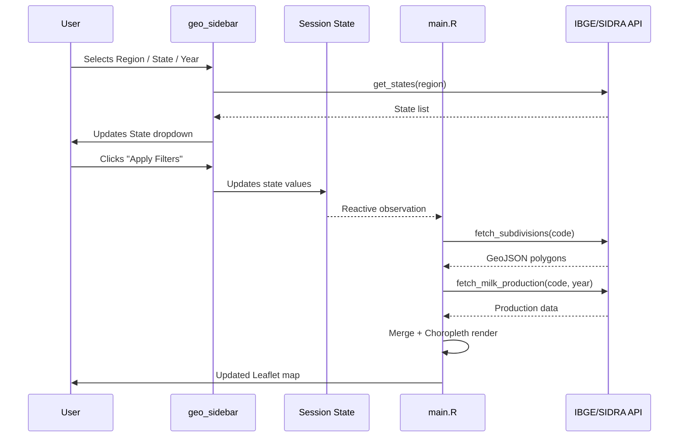

# Arquitetura — zarc-app

## Visão Geral

O **zarc-app** segue a arquitetura [Rhino](https://appsilon.github.io/rhino/), que impõe uma separação estrita entre **lógica de negócio** e código de **UI/visualização**. Este padrão melhora a testabilidade, manutenibilidade e permite reuso futuro de módulos em diferentes interfaces.

---

## Separação de Módulos



---

## Camadas

### `app/logic/` — Lógica de Negócio

Arquivos neste diretório contêm **funções R puras** sem reatividade Shiny. Elas podem ser:

- Testadas independentemente (sem sessão Shiny na maioria dos testes)
- Reutilizadas em scripts, APIs ou outras aplicações
- Mockadas facilmente em testes de integração

| Arquivo     | Responsabilidade                                                  |
|-------------|------------------------------------------------------------------|
| `ibge.R`    | Chamadas HTTP para API Localidades do IBGE (regiões, estados, mesorregiões) e API SIDRA (Tabela 74 — produção leiteira) |
| `state.R`   | Gerencia objeto de estado `reactiveValues` da sessão; serialização JSON para "pesquisa compartilhável" |

### `app/view/` — Módulos Shiny

Arquivos aqui definem **módulos Shiny** (pares UI + Server) que lidam com interação do usuário e reatividade.

| Arquivo           | Responsabilidade                                |
|-------------------|------------------------------------------------|
| `geo_sidebar.R`   | Dropdowns de filtro em cascata (Região → Estado → Mesorregião → Ano) com botão "Aplicar" e exportação de sessão |

### `app/main.R` — Ponto de Entrada

Módulo de nível superior que:

1. Define o layout da página (sidebar + mapa)
2. Inicializa o estado da sessão (`state$create_state()`)
3. Conecta módulos filhos
4. Renderiza o mapa coroplético Leaflet reativamente com base nas mudanças de estado

---

## Sistema de Importação

Todas as importações usam o sistema de módulos `{box}`:

```r
# Importa funções de lógica
box::use(app/logic/ibge[get_regions, get_states])

# Importa um módulo de visualização
box::use(app/view/geo_sidebar)
```

Isso garante:
- **Dependências explícitas** — sem chamadas `library()` ocultas
- **Namespacing** — evita colisões de nomes de funções
- **Rastreabilidade** — cada importação é auditável

---

## Gerenciamento de Estado

O estado da sessão (`app/logic/state.R`) atua como **fonte única da verdade**:

```
Interação do Usuário → geo_sidebar (atualiza estado) → main.R (observa estado → renderiza mapa)
```

O estado é serializável para JSON, permitindo:
- **Pesquisa reproduzível** — compartilhe configurações exatas de filtro
- **Persistência de sessão** — restaure sessões de análise anteriores
- **Trilha de auditoria** — registre caminhos de exploração do pesquisador

---

## Fluxo de Dados


