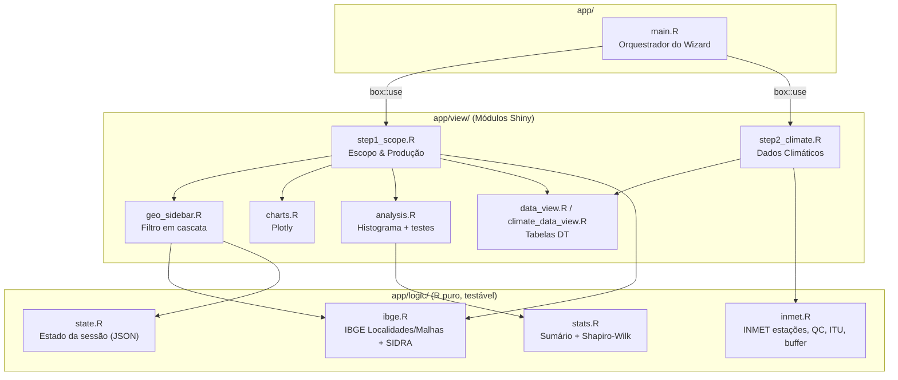
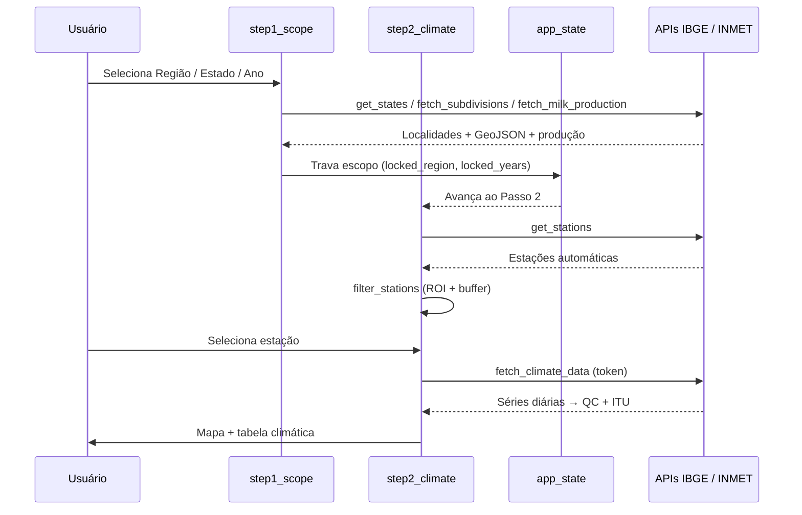

# Arquitetura — zarc-app

## Visão Geral

O **zarc-app** segue a arquitetura [Rhino](https://appsilon.github.io/rhino/), que impõe uma separação estrita entre **lógica de negócio** e código de **UI/visualização**. Este padrão melhora a testabilidade, manutenibilidade e permite reuso futuro de módulos em diferentes interfaces.

A aplicação é um **assistente (wizard) de dois passos**, orquestrado por `app/main.R`:

1. **Passo 1 — Escopo & Produção Leiteira**: seleção geográfica do IBGE, mapa coroplético, gráficos, análise estatística e tabela de dados leiteiros (SIDRA).
2. **Passo 2 — Dados Climáticos**: estações automáticas do INMET, filtragem espacial com buffer, e séries diárias com Controle de Qualidade e ITU.

---

## Separação de Módulos



---

## Camadas

### `app/logic/` — Lógica de Negócio

Arquivos neste diretório contêm **funções R puras** sem reatividade Shiny. Podem ser testadas, reutilizadas e mockadas independentemente.

| Arquivo     | Responsabilidade                                                  |
|-------------|------------------------------------------------------------------|
| `ibge.R`    | API de Localidades do IBGE (regiões, estados, meso/microrregiões, municípios), API de Malhas (GeoJSON) e API Agregados/SIDRA (Tabela 74 — produção leiteira), incluindo limpeza de valores especiais e validação do limite de 100k da API |
| `inmet.R`   | API do INMET: lista de estações automáticas, filtragem espacial por ROI (projeção EPSG:5880 para evitar erros de geometria esférica), busca de séries diárias autenticadas, Controle de Qualidade e cálculo de ITU (Buffington 1977), e buffer métrico de polígonos |
| `state.R`   | Gerencia objeto de estado `reactiveValues` da sessão; serialização/desserialização JSON para "pesquisa compartilhável" |
| `stats.R`   | Estatísticas descritivas e teste de normalidade de Shapiro-Wilk com interpretação em pt-br |

### `app/view/` — Módulos Shiny

Pares UI + Server que lidam com interação do usuário e reatividade.

| Arquivo               | Responsabilidade                                |
|-----------------------|------------------------------------------------|
| `step1_scope.R`       | Passo 1 do wizard: encapsula seleção geográfica, mapa, gráficos, análise e tabela |
| `step2_climate.R`     | Passo 2 do wizard: filtragem espacial de estações, buffer, mapa e busca de dados climáticos |
| `geo_sidebar.R`       | Dropdowns de filtro em cascata de 4 níveis (Região → Estado → Mesorregião → Ano) |
| `charts.R`            | Gráfico de barras animado e gráfico de linhas (Plotly) |
| `analysis.R`          | Histograma, estatísticas descritivas e teste de normalidade |
| `data_view.R`         | Tabela de dados leiteiros com alternância bruto/processado e amostrador de linhas (DT) |
| `climate_data_view.R` | Tabela de dados climáticos do INMET com amostrador de linhas (DT) |

### `app/main.R` — Orquestrador do Wizard

Módulo de nível superior que:

1. Define o `page_navbar` com os dois passos (Escopo, Clima)
2. Inicializa o estado reativo global (`app_state`)
3. Conecta os módulos `step1_scope` e `step2_climate`
4. Controla a navegação automática: avança ao Passo 2 quando a região é "travada", retorna ao Passo 1 ao destravar

---

## Sistema de Importação

Todas as importações usam o sistema de módulos `{box}`:

```r
# Importa funções de lógica
box::use(app/logic/ibge[get_regions, get_states])

# Importa um módulo de visualização
box::use(app/view/step1_scope)
```

Isso garante **dependências explícitas** (sem `library()` oculto), **namespacing** e **rastreabilidade**.

---

## Gerenciamento de Estado

O estado da sessão (`app/logic/state.R` + `app_state` em `main.R`) atua como **fonte única da verdade**, fluindo entre os passos:

```
Passo 1 (escopo geográfico + produção) → app_state → Passo 2 (estações dentro da ROI)
```

O estado é serializável para JSON, permitindo pesquisa reproduzível, persistência de sessão e trilha de auditoria.

---

## Fontes de Dados (ingestão ao vivo)

Atualmente o app consulta as APIs **em tempo real** a cada sessão:

| Fonte | Endpoint | Usado em |
|---|---|---|
| IBGE Localidades | `servicodados.ibge.gov.br/api/v1/localidades/...` | `ibge.R` (cascata de filtros) |
| IBGE Malhas | `servicodados.ibge.gov.br/api/v3/malhas/...` | `ibge.R` (`fetch_geojson`, `fetch_subdivisions`) |
| IBGE Agregados / SIDRA | `servicodados.ibge.gov.br/api/v3/agregados/74/...` | `ibge.R` (`fetch_milk_production`) |
| INMET estações | `apitempo.inmet.gov.br/estacoes/T` | `inmet.R` (`get_stations`) |
| INMET diário | `apitempo.inmet.gov.br/token/estacao/diaria/...` | `inmet.R` (`fetch_climate_data`, requer `INMET_TOKEN`) |



---

## Migração planejada para o `zarc-etl`

A ingestão ao vivo tem custos conhecidos: latência e instabilidade das APIs no
caminho crítico do Shiny, rate limiting e dependência de rede por sessão. Por
isso a coleta foi extraída para o repositório irmão
[`zarc-etl`](https://github.com/santosangel0/zarc-etl) (Python + Polars), que
roda em batch e produz parquets imutáveis em `data/final/` (ZSTD, ordenação
física para predicate pushdown, geometrias em WKB).

> **Status:** ainda **não** migrado. O `zarc-app` continua chamando as APIs ao
> vivo. A adaptação está planejada como entrega futura — ver o
> [plano de integração](https://github.com/santosangel0/zarc-etl/blob/dev/docs/08-integracao-zarc-app.md)
> e os [contratos de dados](https://github.com/santosangel0/zarc-etl/blob/dev/docs/06-contratos-de-dados.md)
> no repositório do ETL.

Plano de migração (resumo do `zarc-etl/docs/08`):

1. Substituir `inmet.R::fetch_climate_data` por leitura de
   `inmet_historico_diario.parquet` via DuckDB (predicate pushdown por estação/período).
2. Substituir `ibge.R::fetch_geojson` por leitura dos `ibge_malhas_*.parquet`
   (`sf::st_as_sfc(geometry, crs = 4326)` sobre a coluna WKB).
3. Substituir `ibge.R::fetch_milk_production` por leitura de `milk_production.parquet`.
4. Manter as funções de visualização/transformação que **não** pertencem ao ETL:
   `filter_stations`, `buffer_polygon` (`inmet.R`), `state.R`, `stats.R`.
5. Adicionar variável `zarc_etl_data_dir` no `config.yml` para localizar os parquets.
6. Atualizar o `Dockerfile` para montar o volume compartilhado com
   `zarc-etl/data/final/` (ou copiar os parquets na build).

O esquema dos parquets já espelha as funções atuais (ex.: o schema de
`inmet_historico_diario.parquet` corresponde à saída de `fetch_climate_data`),
de modo que a migração é, em larga medida, troca da fonte mantendo as colunas.
